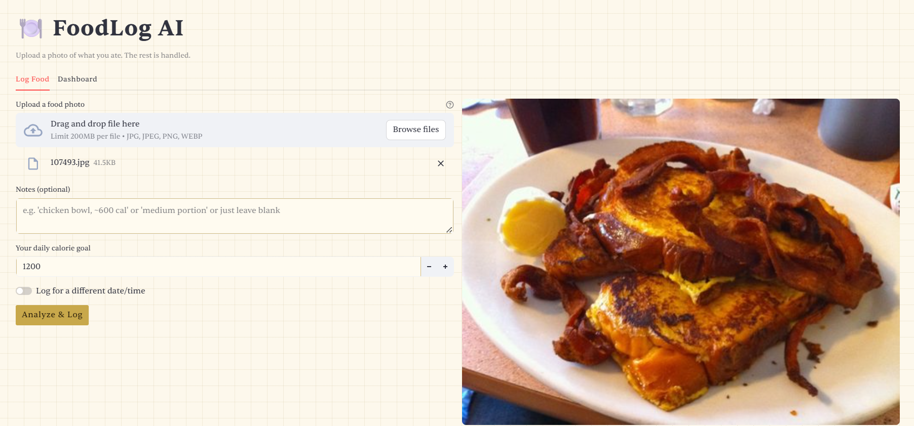
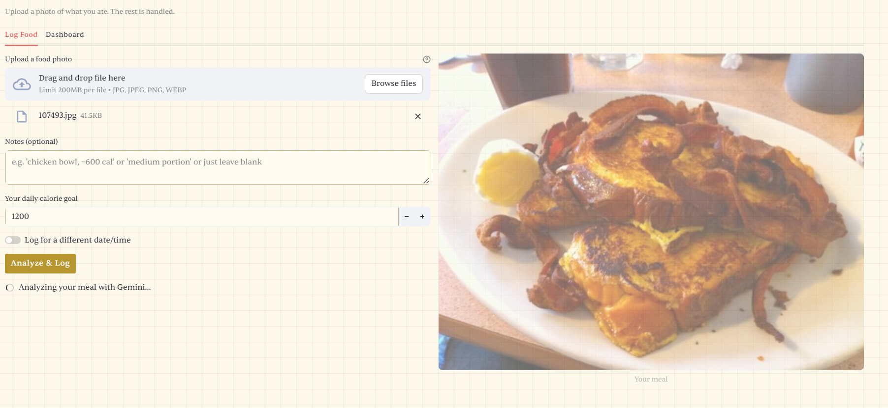
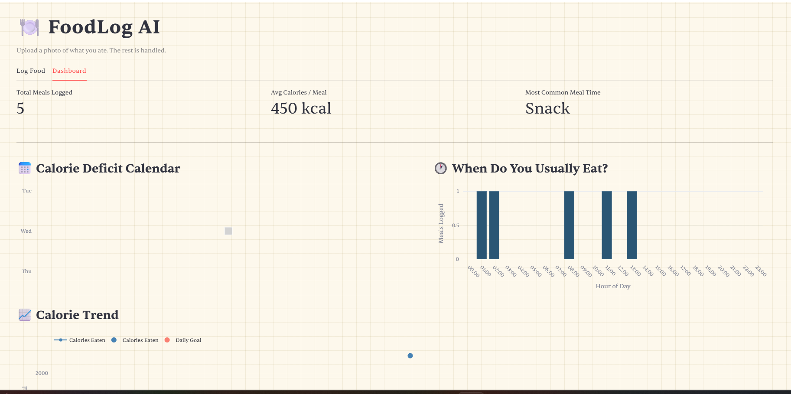
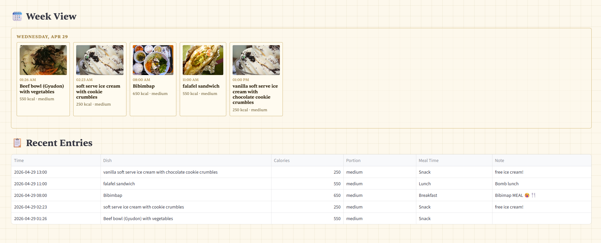

# FoodLog AI 🍽️

> A smart food journaling web app that turns a photo into a full nutrition log — no manual entry required.

---

## Summary

FoodLog AI is a Streamlit-based web application that lets users photograph their meals and optionally add a short note. Using Google Gemini's multimodal vision API, the app automatically identifies the dish, estimates calories, infers portion size, and categorizes the meal by time of day — all from a single image. The data is logged locally and visualized in a personal dashboard with a calorie-deficit heatmap calendar, meal-time distribution chart, and daily calorie trend.

This project evolved from a simple food tracker concept into an AI-powered logging system that removes the friction of manual calorie counting.

---

## Architecture Overview

The app is split into a UI layer and a logic layer — the Streamlit app never contains business logic directly.

```
your-repo/
├── app.py                     # Streamlit UI only — imports from food_logger/
├── model_card.md              # AI model documentation
├── requirements.txt
├── .env                       # Your Gemini API key (not committed)
├── food_logger/
│   ├── gemini_client.py       # All Gemini API calls + response parsing
│   ├── storage.py             # Read/write to data/log.json
│   └── dashboard.py           # Plotly chart builders
├── data/
│   └── log.json               # Local flat-file database
└── uploads/                   # Saved meal images
```

**Data flow:**

```
User uploads image + optional note
          ↓
gemini_client.py → single Gemini Vision API call
          ↓
Returns structured JSON (dish, calories, portion, meal time)
          ↓
storage.py → appends entry to data/log.json
          ↓
dashboard.py → reads log → builds Plotly charts
          ↓
app.py → renders charts in Streamlit dashboard tab
```

No external database, no backend server. Everything runs locally.

---

## Setup Instructions

### Prerequisites
- Python 3.10 or higher
- A free Gemini API key from [Google AI Studio](https://aistudio.google.com)

### Steps

**1. Clone the repo**
```bash
git clone https://github.com/your-username/foodlog-ai.git
cd foodlog-ai
```

**2. Create and activate a virtual environment**
```bash
python -m venv .venv

# Windows
.venv\Scripts\activate

# Mac/Linux
source .venv/bin/activate
```

**3. Install dependencies**
```bash
pip install -r requirements.txt
```

**4. Set up your API key**

Create a `.env` file in the root of the project:
```
GEMINI_API_KEY=your_key_here
```

**5. Initialize the data file**

Create a `data/` folder and an empty log file:
```bash
mkdir data
echo [] > data/log.json
```

**6. Run the app**
```bash
streamlit run app.py
```

The app will open at `http://localhost:8501`.

---

## Sample Interactions

## Sample Interactions

##### Uploading one meal


The Log Food tab lets you drag and drop a meal photo, optionally add a note,
set your daily calorie goal, and choose whether to log it now or for a past
date and time. The meal photo previews on the right instantly after upload.

##### Analysing your meal


Once you hit **Analyze & Log**, Gemini Vision processes the image in the
background. The spinner confirms the AI is at work — no manual input needed
beyond the photo itself.

#### Dashboard views



The dashboard gives you three at-a-glance metrics at the top: total meals
logged, average calories per meal, and your most frequent meal time. Below,
the Calorie Deficit Calendar marks each day as green (deficit) or gray
(surplus), while the **When Do You Usually Eat?** bar chart breaks down your
eating habits by hour of day.



The Week View lays out every meal as a card, ordered left to right by time
within each day. Each card shows the food photo, exact time eaten, dish name,
and calorie + portion summary — giving you a visual timeline of your entire
eating pattern for the week at a glance.
---

## Design Decisions

**Single Gemini API call for everything**
Rather than using separate models or pipelines for image recognition, calorie estimation, and note parsing, a single multimodal Gemini call handles all three. This keeps latency low, reduces complexity, and takes advantage of the model's ability to cross-reference the image with the user's note in one context window.

**Flat JSON file instead of a database**
For a single-user local app with a 90-minute build window, SQLite or Postgres would be overkill. A local `log.json` file is trivially readable, debuggable, and portable — and Pandas/Python can handle thousands of entries without performance issues.

**Logic separated from UI**
`app.py` contains zero business logic. All AI calls, parsing, storage, and chart building live in `food_logger/`. This makes the codebase easier to test, extend, and hand off. Swapping Gemini for a different model, or JSON for SQLite, only requires changing one file.

**Retro entry support**
Users can toggle a date/time picker to log meals after the fact. This was added to support realistic use — people often forget to log in the moment. The timestamp drives meal-time classification and the calendar heatmap, so accuracy matters.

**Calendar heatmap using scatter plot**
Plotly doesn't have a native calendar heatmap, so the dashboard builds one using a scatter plot with square markers laid out in a weekly grid. Green squares = calorie deficit days. Gray = surplus or no data.

---

## Testing Summary

Testing was limited due to Gemnini API limits.

---

## Reflection

This project made the case for **multimodal AI as a UX tool, not just a tech feature**. The core insight was that the biggest friction in food logging isn't motivation — it's the manual work of looking up calories and categorizing meals. Offloading that entirely to a vision model means the user experience collapses to: take photo, optionally add a note, done.

The main lesson in AI problem-solving was around **prompt design over model complexity**. Early attempts used vague prompts and got inconsistent JSON back. Tightening the output schema in the system prompt — specifying exact field names, types, and fallback values — made the outputs reliable without needing fine-tuning or post-processing rules.

The trade-off between simplicity and accuracy is real: Gemini's calorie estimates are approximations, and the app is upfront about that. For a personal journaling tool, "roughly right" is good enough. For anything clinical, it wouldn't be.

Building this also reinforced the value of **separating concerns early**, even on a tight timeline. The hour spent structuring `food_logger/` as a proper package paid off every time a bug needed isolating — the problem was always in one file, never tangled across the app.